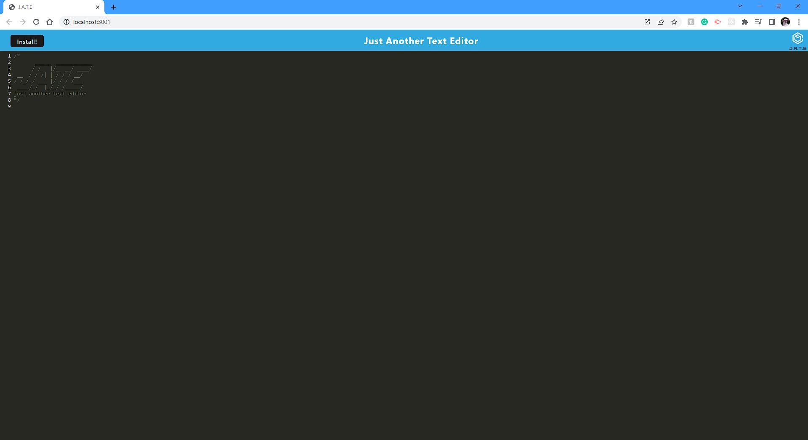
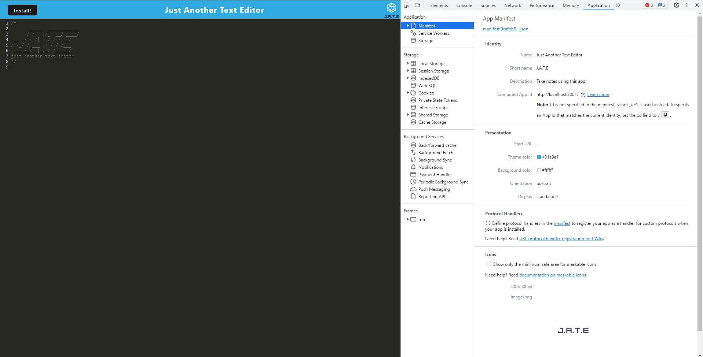
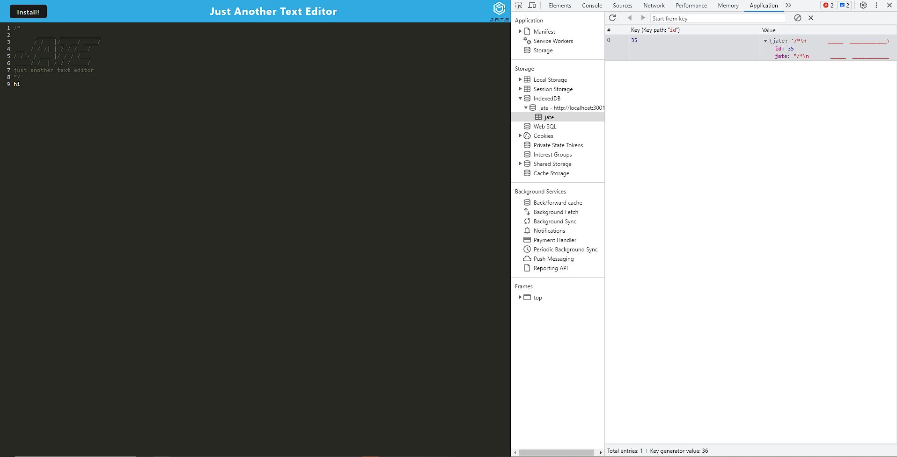

# Text-Editor 

  # n/a

  ## Description

  It's a PWA back-end application it allows you to use the app locally without the internet or using the Heroku link above it's a text editor you can use to type out code or any text like for example 'console.log("Hello");'

  ## Table of Contents

  -[Installation](#installation)
  -[Usage](#usage)
  -[License](#license)
  -[Contact](#contact)

  ## Installation

 To install so you can use this locally,

 Clone the repository
 `git clone https://github.com/TinyTiimbo/Text-Editor.git`

 Navigate to Project
  `cd Text-Editor`

Install dependencies 
  `npm install`

Then start application
  `npm start`

  Then you'll be able to access port http://localhost:3001

  ## Usage
  

  
  Anybody who wants to save information via text editor. It can be useful for text but mainly for code.
  
  ## License
  
  
  This project is licensed under the MIT license. 
  See the [LICENSE](./LICENSE) file for details.

  ## Contact

  Any questions or concerns here is my contact info below.

  -Github: [@TinyTiimbo](https://github.com/TinyTiimbo)
  -Email sophia.palomo12@gmail.com;
